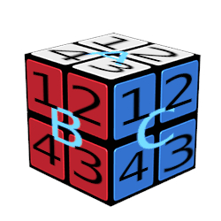
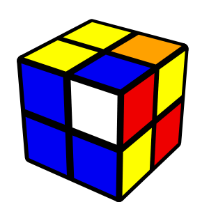

J3RN's Rubik's Cube Solvers
===========================

Right now there's only a 2x2 solver, and it finds solutions in ~45s on my machine with SWI-Prolog.  I intend to add a 3x3 solver eventually, but feel that I should probably find a way to optimize my general algorithm such that it will finish before the heat death of the universe.

### Mapping from Cube to Prolog

Use this image as a general guide:



The top face is "A", left face is "B", and the right face is "C". One each side, the four tiles are labeled 1-4 clockwise from the top-left.  Not shown in the image, but the face opposite of "A" is "F", the face opposite of "B" is "D", and the face opposite of "C" is "F".

### Using the Program

After loading the program `[two_by_two].`, you will use the `newsolve/2` clause to solve your cube like so:
```
newsolve(Moves, Matrix).
```

The `Matrix` variable should be a description of the cube; faces should be entered in letter order (A, then B, then C, ...) and tiles in number order (1, then 2, then 3, ...).  Each tile's color is represented by a one-letter atom; `y` for yellow, `o` for orange, etc.

For instance, if your cube looks like this:



Then you would write:
```
newsolve(Moves, [[y, o, b, y], [b, w, b, b], [r, y, r, y], ..., ..., ...]).
```

The `...` for the last three lists are because the other three faces aren't visible and I haven't determined yet what they are.
